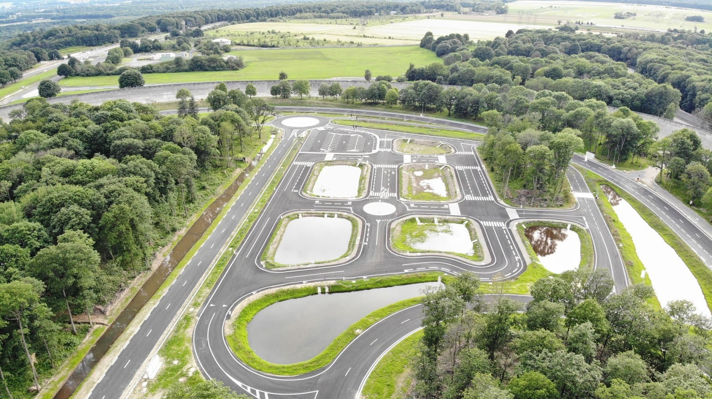

# TX n°7491 - Control and Decision-Making architecture for a fleet of shared autonomous vehicles in a dense urban environment

This project implements a Decision-Making architecture and a control law for autonomous vehicles working both on MATLAB and Carla simulator.

    <table>
	    <tr>
    	    <td style="padding:10px">
        	    
      	    </td>
            <td style="padding:10px">
            	
            </td>
        </tr>
    </table>

## Documentation

Technical documentation can be found on the following link : [Documentation Website](https://utonome.gitlab.utc.fr/documentation/decisions-control/index.html)

## Running the project

To run the project on MATLAB_R2024a :
- include `src`folder in MATLAB path
- run `debug_control.m`

---

Credits : Theo GUEGAN - Universite de Technologie de Compiegne - 2024